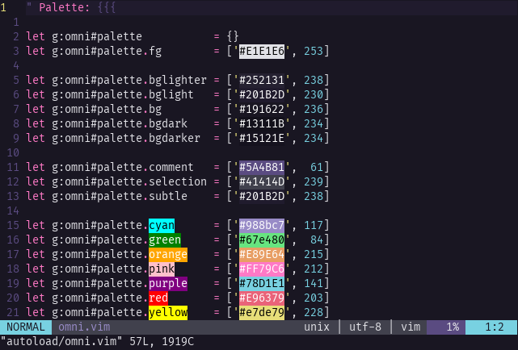

# Omni For [Vim](http://www.vim.org/)

> A dark theme for [Vim](http://www.vim.org/)



## Install

1. Create theme folder (in case you don't have yet):

```
mkdir -p ~/.vim/pack/themes/start
```

2. Navigate to the folder above:

```
cd ~/.vim/pack/themes/start
```

3. Clone the repository using the "omni" name:

```
git clone https://github.com/GuiLra/vim-omni omni
```

4. Create configuration file (in case you don't have yet):

```
touch ~/.vimrc
```

5. Edit the `~/.vimrc` file with the following content:

```
packadd! omni 
syntax enable
colorscheme omni
```

## License

MIT License
